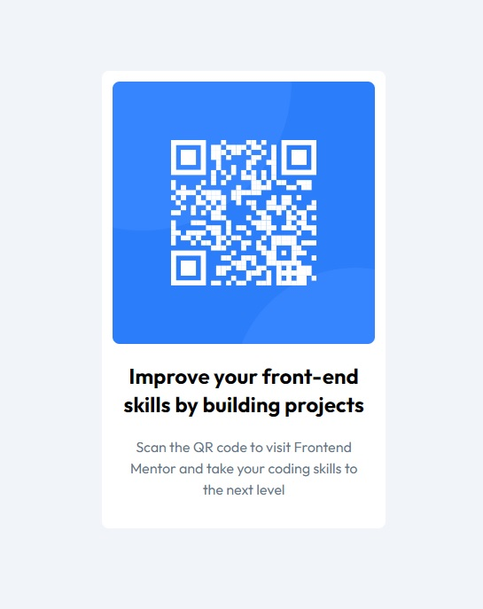

# Frontend Mentor - QR code component solution

## Table of contents

- [Overview](#overview)
  - [Screenshot](#screenshot)
  - [Links](#links)
- [My process](#my-process)
  - [Built with](#built-with)
- [Author](#author)

**Note: Delete this note and update the table of contents based on what sections you keep.**

## Overview

### Screenshot

### Links

- Solution URL: [GitHub](https://github.com/Pablo-Zallio-Dev/qr-component)
- Live Site URL: [Netlify](https://component-qr-card.netlify.app/)

## My process

### Built with

- Semantic HTML5 markup
- CSS custom properties
- Flexbox
- CSS Grid
- Mobile-first workflow
- [Taildwind](https://tailwindcss.com/) 

## Author

- Website - [GitHub](https://github.com/Pablo-Zallio-Dev)
- Frontend Mentor - [Pablo Zallio Dev](https://www.frontendmentor.io/profile/Pablo-Zallio-Dev)
- Linkedin - [Pablo Web Developer](https://www.linkedin.com/in/pablo-damian-zallio-zabala-140b83278/)

